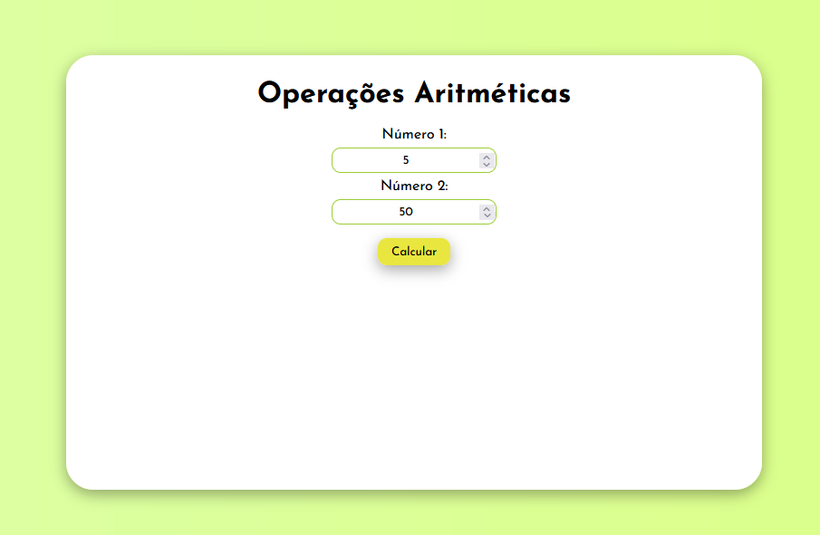
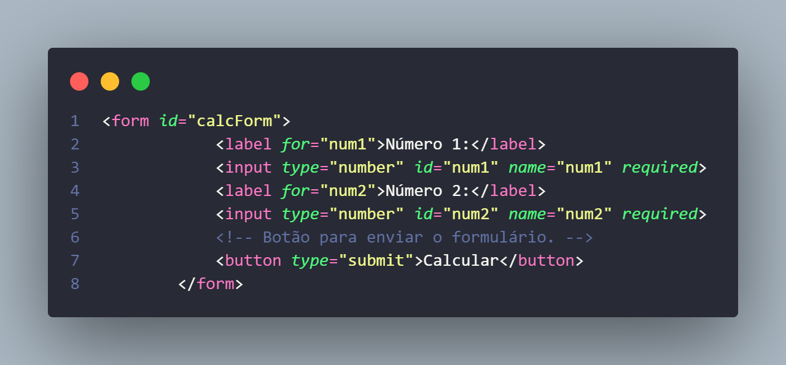
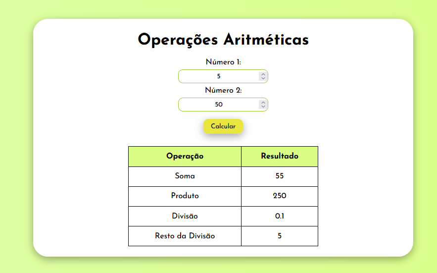
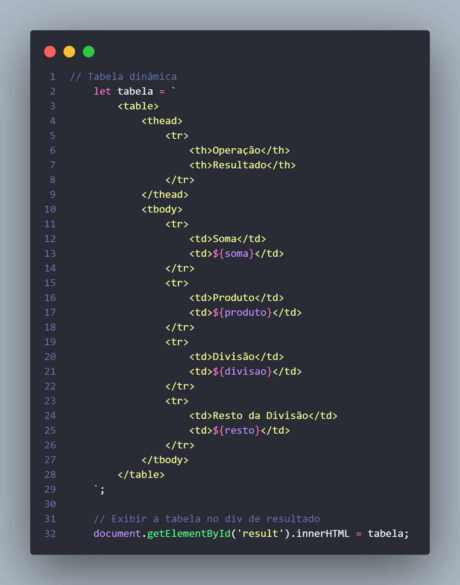

# Operações Aritméticas | BR 🧮
✨ Olá, seja bem vindo a mais um projeto no meu GitHub !!! ✨

Hoje apresento um projeto simples para treinar a linguagem de programação JavaScript. Nesse projeto temos: ouvinte de evento, função anônima, operações aritméticas e tabela dinâmica.

Para a elaboração do projeto foram utilizados: HTML, CSS e JS.

## Valores
O usuário irá adicionar dois valores inteiros para a realização dos cálculos.
Abaixo código do formulário.

 

## Resultados
Após a adição dos valores o usuário irá clicar em "Calcular" e o resultado aparecerá em uma tabela contendo os seguintes resultados: Soma, Produto, Divisão e Resto da Divisão.
Abaixo o código da tabela e ação do resultado.

 

 

# Observação!!!
#### Espero que tenha gostado do projeto! Nos vemos no próximo 🖐 

